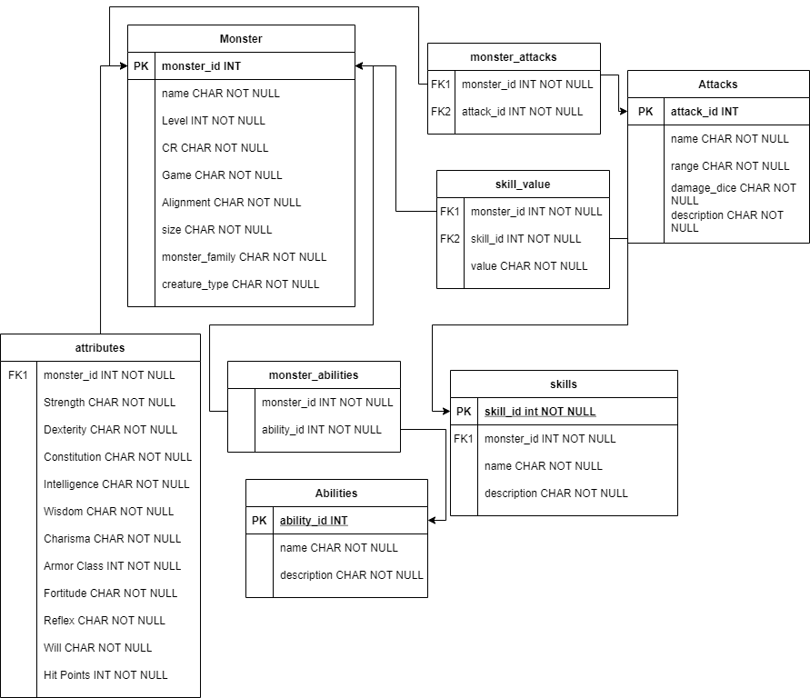

# Overview

My software creates a database for monsters for table top RPGs. It also creates a interface by which you can view, add to, update, and delete from the monsters in the database.

The purpose of this project was to deepen my understanding about database construction, and to understand how to create a user interface to input data into the database. This project is also useful for me to manage the monsters in the table top RPG games that I play. 

[Software Demo Video](https://youtu.be/GkcYYH2zm0g)

# Relational Database

I have been using SQLite to creates and manage this database

The main table is the monsters table. The monsters table is connected to the attributes table. The monsters table has a many-to-many relationship with the attacks, skills, and abilities tables, so it is connected to monster_attacks, skill_value, and monster_abilities tables which then connect to the other tables as shown in the diagram below.

# Development Environment

I used the following software to build this project.
* Visual Studio Code
* SQLite Visual Studio Code extension

I used the following Programming languages to build this project.
* Python
* SQLite3

# Useful Websites

{Make a list of websites that you found helpful in this project}
* [Python.org SQLite3 documentation](https://docs.python.org/3/library/sqlite3.html)
* [SQLite Tutorial](https://www.sqlitetutorial.net/sqlite-python/)
* [Website](https://2e.aonprd.com/Monsters.aspx?ID=799)  with Pathfinder 2nd Edition monsters

# Future Work

Here are some things I plan to do in the future to improve this Database.
* The ability to add items to the other tables in the database
* The ability to display items in the database
* The ability to update all the columns in all the tables of the database